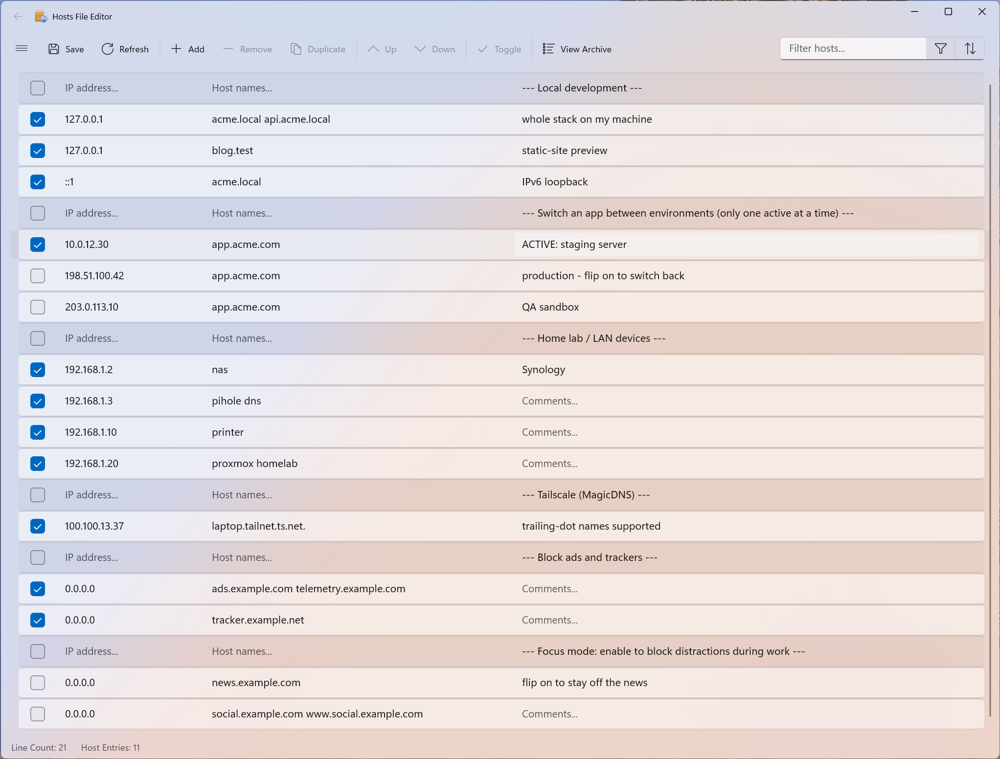
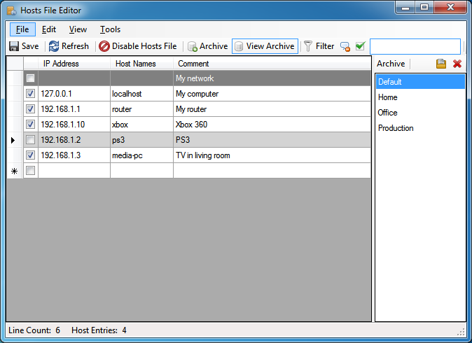
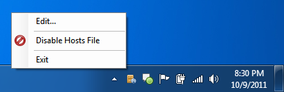

**A fast, friendly editor for the Windows `hosts` file.**

[](https://github.com/scottlerch/HostsFileEditor/releases)
[](License.md)
[](https://apps.microsoft.com/detail/9NBQWCDXGF9R)

The Windows `hosts` file (`%WinDir%\System32\drivers\etc\hosts`) maps hostnames to IP
addresses before DNS is consulted &mdash; handy for pointing a domain at a local dev server,
blocking sites, testing deployments, or switching between environments. Editing it by hand in
Notepad is tedious and error-prone. **Hosts File Editor** turns it into a proper table you can
cut, copy, paste, enable, disable, sort, filter, and archive &mdash; with full undo/redo and a
one-click toggle for the whole file.

It runs as a standard user and elevates on demand (a single UAC prompt) only when you actually
save changes to the hosts file, so day-to-day viewing, archiving, and backups need no admin rights.


</br>
*main modern editor (light)*

## Features
 * Cut, copy, paste, duplicate, enable, disable and move one or more entries at a time
 * Filter and sort when there are a large number of host entries
 * Quickly enable and disable the entire hosts file
 * Archive and restore various hosts file configurations (presets) when switching between environments
 * Merge another hosts file into the current one, skipping duplicates
 * Automatically ping endpoints to check availability, with a status-bar progress indicator
 * Switch presets straight from the taskbar &mdash; right-click the app for a Jump List of your archives
 * Full [command line](#command-line) for scripting: switch presets, enable/disable, import/merge
 * Global shortcut key (default `Ctrl+Shift+H`) to hide/restore the classic edition from the tray
 * Modern variant supports light and dark themes


</br>
*main classic editor with optional archive visible on right*


</br>
*tray icon with context menu*

### Usage Notes

By default the classic edition closes to the tray. To exit completely you must select Exit from the File menu or tray context menu. Only one instance of the application is allowed at a time. If you try to open it again it will just activate the previously running instance.

When selecting rows to move, delete, copy, or cut be sure to select the entire row using the row header cell. If no entire rows are selected, cut, copy, paste, and delete apply individually to the selected cells.

Using the filter and sort while editing is quirky. The filter and sort are applied once a cell is edited so your cell may change positions or disappear depending on the current sort and filter.

## Command line

Both editions include a headless command line (v1.5.0 classic / v1.2.0 modern) so scripts can switch
presets and toggle the hosts file &mdash; for example, applying a preset before launching a program and
restoring it afterward:

```bat
hfe -s MyHosts1
program.exe
hfe -s DefaultHosts
```

### Commands

| Command | Effect |
|---|---|
| `apply <preset>` (alias `-s`, `switch`) | Switch the hosts file to a saved preset (archive) |
| `enable` | Enable the hosts file |
| `disable` | Disable the hosts file (renames it aside) |
| `import <file>` | Replace the hosts file with `<file>`, then save |
| `merge <file>` | Merge `<file>` into the hosts file, skipping duplicates, then save |
| `list` | List available presets |
| `help` (`--help`, `-h`) | Show usage |

Presets are the archives you save in the app (the **Archive** feature); `apply` matches the archive
name case-insensitively, with or without its file extension.

**Exit codes:** `0` success &middot; `1` runtime error (preset or file not found, permission declined)
&middot; `2` usage error (unknown or malformed command). Errors print a one-line message to stderr.

### `hfe.exe` vs `HostsFileEditor.exe`

Two executables run the same commands:

* **`hfe.exe`** &mdash; a small console launcher that ships next to the app. **Use this in scripts**:
  it is a console app, so `cmd` and PowerShell wait for it to finish before running the next line, and
  its output pipes/redirects naturally. Store installs also register `hfe` on `PATH` (an app-execution
  alias), so `hfe -s MyHosts1` works from any console.
* **`HostsFileEditor.exe`** &mdash; the app itself also accepts the same commands and runs them headless
  (no window). Because it is a windowed app, `cmd` does *not* wait for it &mdash; wrap it as
  `start /wait "" HostsFileEditor.exe -s MyHosts1` for sequential steps, or just use `hfe.exe`.

Run with no command and the app opens normally.

> **Both editions installed?** The classic and modern Store apps each register the same `hfe` alias.
> Windows treats the duplicate as a conflict, so **which edition owns `hfe` isn't guaranteed** &mdash;
> pick the one you want under *Settings &rarr; Apps &rarr; App execution aliases* (Windows 11:
> *Advanced app settings &rarr; App execution aliases*). Each Store package also keeps its **own
> isolated app data**, so `hfe list` reflects whichever edition the alias points at, which may differ
> from the other edition's window. If you script with `hfe`, install just the edition you script
> against &mdash; or call that edition's `hfe.exe` by full path. Portable (zip) builds are unpackaged
> and don't register the alias at all, so this is a Store-install-only concern (and only the classic
> edition ships a portable build).

### Permissions

Commands that change the hosts file need administrator rights, exactly like saving in the GUI: run
from an elevated console for silent operation, or accept the single UAC prompt per command. A declined
prompt cancels cleanly with exit code `1`. `list` and `help` never need elevation.

Note: the CLI runs independently of an open GUI window &mdash; if the editor is open with unsaved
changes, a CLI change to the hosts file isn't reflected there until you refresh (F5), and saving stale
GUI edits afterward overwrites the CLI's change (last writer wins).

## Download

Runs on Windows 10 and 11, x64 or ARM64. Two editions are available &mdash; pick whichever you prefer;
they share the same core and features.

### Microsoft Store &mdash; recommended

Installs and updates automatically, with no separate download:

 * [Hosts File Editor (modern)](https://apps.microsoft.com/detail/9NBQWCDXGF9R) &mdash; the new WinUI edition
 * [Hosts File Editor (classic)](https://apps.microsoft.com/detail/9NF73PSPK332) &mdash; the classic WinForms edition

### Portable &mdash; v1.5.0

The **classic edition** rebuilt on .NET 10: fully self-contained (no runtime to install), runs as a standard user, and elevates on demand (a single UAC prompt) only when you save changes to the hosts file. Binaries are signed. Download directly from [GitHub Releases](https://github.com/scottlerch/HostsFileEditor/releases):

 * [Download v1.5.0 portable &mdash; x64](https://github.com/scottlerch/HostsFileEditor/releases/download/v1.5.0/HostsFileEditor-1.5.0-x64.zip)
 * [Download v1.5.0 portable &mdash; ARM64](https://github.com/scottlerch/HostsFileEditor/releases/download/v1.5.0/HostsFileEditor-1.5.0-arm64.zip)

_What's new in v1.5.0 (classic) / v1.2.0 (modern):_ a **feature release**. A full **[command line](#command-line)** in both editions plus a new `hfe.exe` console launcher &mdash; switch presets, enable/disable, import, and merge from scripts (Store installs put `hfe` on `PATH`). A taskbar **Jump List**: right-click the app icon to open any preset directly. **File &rarr; Merge** combines another hosts file into the current one, skipping duplicates (undoable). The modern edition gains **Sort options** next to the filter, and the **IP column now sorts numerically** in both editions (`8.8.8.8` before `10.0.0.2` before `10.0.0.10`, IPv6 after IPv4). **Auto-ping** shows a status-bar progress indicator while pings are in flight, flags per-entry failures (modern gets an error badge with tooltip), and pings immediately when enabled. The classic edition adds a **global shortcut** (default `Ctrl+Shift+H`, configurable) to hide/restore from the tray, its text **filter is now case-insensitive** to match modern, the parser validates IPs strictly at parse time, and the portable zip dropped ~9 MB of unused libraries. See the [full release notes](https://github.com/scottlerch/HostsFileEditor/releases/tag/v1.5.0).

_What's new in v1.4.1:_ a small maintenance patch &mdash; the classic edition no longer targets the wrong entry when you **Insert or Move right after a Move** (the current-row anchor is restored by identity), and the modern edition skips a redundant filter pass on very large selections. See the [full release notes](https://github.com/scottlerch/HostsFileEditor/releases/tag/v1.4.1).

_What's new in v1.4.0:_ a broad **performance** pass for very large hosts files &mdash; **smaller installs** (classic ~124 MB &rarr; ~53 MB), a **~3&times; faster** parser, an **async load** behind a progress indicator, and **responsive editing** (cut / paste / duplicate / move / enable-disable / select-all / sort no longer freeze on ~400K-entry files) in both editions. Also: the classic column-header **sort** no longer crashes on .NET 10; the modern edition gains a **status bar** (line + host-entry counts), flicker-free columns, and keeps your selection across Check/Uncheck &amp; Duplicate; and both editions parse **trailing-dot FQDN** hostnames (e.g. Tailscale MagicDNS `host.tailnet.ts.net.`). See the [full release notes](https://github.com/scottlerch/HostsFileEditor/releases/tag/v1.4.0).

_What's new in v1.3.2:_ high-DPI polish and fixes &mdash; the classic edition is now **PerMonitorV2 DPI-aware** (crisp on 4K / scaled displays) with sharper toolbar icons; the taskbar icon renders **unplated** and the elevation prompt shows the app icon (both editions); the **File menu** sits above the toolbar again (classic); the modern edition gained the missing **row keyboard shortcuts** (Del, Ctrl+D, Alt+Arrow move, Ctrl+Alt+Arrow insert); and both editions now **warn about unsaved changes on exit**. See the [full release notes](https://github.com/scottlerch/HostsFileEditor/releases/tag/v1.3.2).

_What's new since v1.2.0:_ a new **modern edition** (WinUI 3) on the Microsoft Store, native **ARM64** builds, a move to **.NET 10** with self-contained deployment, **on-demand elevation** (the app no longer runs entirely as administrator), per-user data under `%LocalAppData%\HostsFileEditor`, Authenticode-signed binaries, and many correctness fixes to undo/redo, move, cut/copy/paste, import/export, and filtering.

### Legacy &mdash; v1.2.0

The last **.NET Framework 4.x** release that runs on Windows 7 and 8: much smaller because it relies on the .NET Framework already built into Windows rather than bundling a runtime, and proven over years of use. Kept here as the last known-good classic build:

 * [Download v1.2.0 installer](https://github.com/scottlerch/HostsFileEditor/releases/download/v1.2.0/HostsFileEditorSetup-1.2.0.msi)
 * [Download v1.2.0 portable](https://github.com/scottlerch/HostsFileEditor/releases/download/v1.2.0/HostsFileEditor-1.2.0.zip)

## Build

Requires .NET 10.0 or later. To build the installer you must have [Windows SDK](https://developer.microsoft.com/en-us/windows/downloads/windows-sdk/) with `makeappx.exe` and `signtool.exe` commands.

To build the application, use the .NET CLI run from Visual Studio 2022 Developer PowerShell so `makeappx.exe` and `signtool.exe` are in your `PATH`:

```powershell
# Build for Debug (includes debugging symbols)
dotnet build -c Debug

# Build for Release (optimized)
dotnet build -c Release

# Build and publish (creates deployable package)
dotnet publish -c Release

# Build and publish with binary logging (recommended for troubleshooting)
dotnet publish -c Release -bl:logs/publish.binlog

# Clean project build artifacts and logs directory
dotnet clean
```

The published apps are fully self-contained &mdash; the classic (WinForms) build bundles the .NET runtime and the modern (WinUI) build bundles both the .NET and Windows App SDK runtimes &mdash; so no separate runtime needs to be installed to run either one. Building and debugging the modern app from source still requires the [Windows App SDK](https://learn.microsoft.com/en-us/windows/apps/windows-app-sdk/downloads) (installed with the Visual Studio "Windows application development" workload).

### Building release artifacts (portable + Store)

Each `dotnet publish` above also packages the project it builds &mdash; the publish step signs the exe,
builds an MSIX with `makeappx`, and (for the classic edition) zips a portable build. To produce **every**
distributable in one shot &mdash; both editions for both architectures &mdash; use the `build-all.ps1`
script instead:

```powershell
# Publish + package classic and modern, for win-x64 and win-arm64
.\build-all.ps1

# Same, but Authenticode-sign the exe and elevation helper (see docs/signing.md)
.\build-all.ps1 -Sign
```

It publishes all four flavor/architecture combinations and lays the output out under `artifacts\`:

- **Portable zips** &mdash; `artifacts\classic\<arch>\HostsFileEditor.zip`. Only the classic (WinForms)
  edition produces a portable zip; these are what ship on GitHub Releases.
- **Store packages** &mdash; the signed `.msix` for both editions, collected into `artifacts\store\` with
  descriptive names (e.g. `HostsFileEditor-modern-x64.msix`) ready to upload to Partner Center.

Signing is **off by default**. The `.msix` *package* doesn't need signing for the Store (Microsoft
re-signs it on ingestion), but signing the **binaries** &mdash; the app exe and the
`HostsFileEditor.Elevate.exe` helper &mdash; is recommended for **both** editions: the Store re-signs
the package, not the exe files inside it, so without `-Sign` the on-demand elevation prompt shows
"Unknown Publisher" instead of a verified publisher. Pass `-Sign` to Authenticode-sign the exe and helper
(Azure Trusted Signing); this also builds SmartScreen reputation for the self-distributed GitHub-release
zip. See [docs/signing.md](docs/signing.md) for setup.

To **submit** those Store packages without the Partner Center portal, `publish-store.ps1` scripts the
submissions via [StoreBroker](https://github.com/microsoft/StoreBroker), Microsoft's PowerShell module
over the Store submission API. Run `.\publish-store.ps1 -InstallTooling` once to install the module,
then `.\publish-store.ps1 -NoCommit` after a signed build: for each edition it clones the current Store
submission, swaps in the new x64+arm64 packages and "What's new" notes, and leaves a Draft to review in
Partner Center (drop `-NoCommit` to commit). See the *Store release automation* section in
[CLAUDE.md](CLAUDE.md) for the one-time Azure AD / Partner Center setup.

### Build Outputs

- Built files are automatically copied to the `.\bin` directory after publishing
- Binary build logs can be generated using the `-bl` flag (e.g., `dotnet build -bl:logs/build-Release.binlog`)
- The build process automatically creates necessary directories (`bin`, `logs`)

You can view binary logs using:
- Visual Studio: File → Open → build log file (.binlog)
- MSBuild Structured Log Viewer: Download from https://msbuildlog.com/

## Contributing

Issues and pull requests are welcome &mdash; see the [open issues](https://github.com/scottlerch/HostsFileEditor/issues) to get started.

The project has recently migrated from **WinForms** to **WinUI 3**. Two UIs currently ship side by side on
top of one shared core library (`HostsFileEditor.Core`): the legacy classic (WinForms) UI and the new
modern (WinUI 3) UI. When changing behavior, prefer putting shared logic in the core so both editions
benefit; new UI work should target the WinUI project.

## License

[GNU General Public License v3](License.md).

_Equin.ApplicationFramework.BindingListView_ is by Andrew Davey and license
terms can be found at <http://blw.sourceforge.net/>.

Icons are from the _Open Icon Library_ and their license and terms can be found at <http://openiconlibrary.sourceforge.net/>.

---

[Privacy Policy](https://hostsfileeditor.com/privacy/) &middot; Made by [Scott Lerch](https://scottlerch.com)
