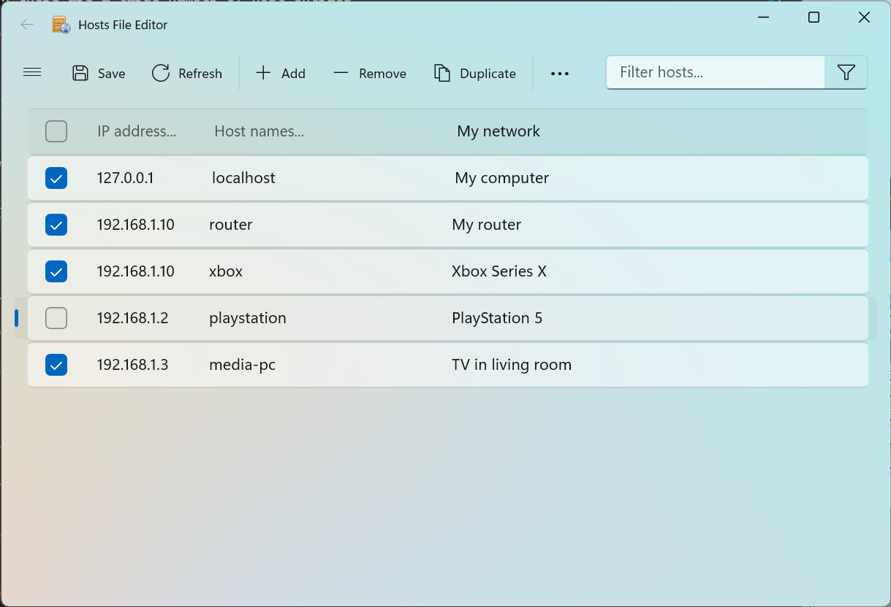
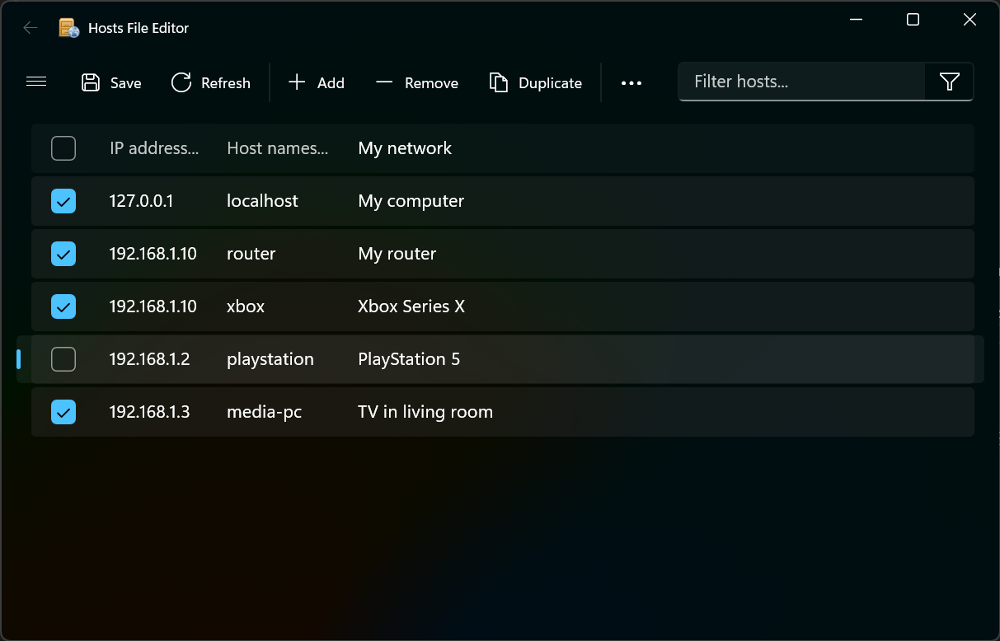

## Download

Release binaries can be downloaded from [GitHub Releases](https://github.com/scottlerch/HostsFileEditor/releases).

### Latest &mdash; v1.3.0 (portable)

The **classic edition** rebuilt on .NET 10: fully self-contained (no runtime to install), runs as a standard user, and elevates on demand (a single UAC prompt) only when you save changes to the hosts file. Binaries are signed.

 * [Download v1.3.0 portable &mdash; x64](https://github.com/scottlerch/HostsFileEditor/releases/download/v1.3.0/HostsFileEditor-1.3.0-x64.zip)
 * [Download v1.3.0 portable &mdash; ARM64](https://github.com/scottlerch/HostsFileEditor/releases/download/v1.3.0/HostsFileEditor-1.3.0-arm64.zip)

_What's new since v1.2.0:_ a new **modern edition** (WinUI 3) coming to the Microsoft Store, native **ARM64** builds, a move to **.NET 10** with self-contained deployment, **on-demand elevation** (the app no longer runs entirely as administrator), per-user data under `%LocalAppData%\HostsFileEditor`, Authenticode-signed binaries, and many correctness fixes to undo/redo, move, cut/copy/paste, import/export, and filtering. See the [full release notes](https://github.com/scottlerch/HostsFileEditor/releases/tag/v1.3.0).

### Microsoft Store

Both editions are being published to the Microsoft Store &mdash; installs and updates are automatic, with no separate download:

 * Hosts File Editor &mdash; modern edition &mdash; _coming soon (pending certification)_ <!-- TODO: replace with the Store listing URL once published -->
 * Hosts File Editor &mdash; classic edition &mdash; _coming soon (pending certification)_ <!-- TODO: replace with the Store listing URL once published -->

### Legacy &mdash; v1.2.0

The last **.NET Framework 4.x** release: much smaller because it relies on the .NET Framework already built into Windows rather than bundling a runtime, and proven over years of use. Kept here as the last known-good classic build:

 * [Download v1.2.0 installer](https://github.com/scottlerch/HostsFileEditor/releases/download/v1.2.0/HostsFileEditorSetup-1.2.0.msi)
 * [Download v1.2.0 portable](https://github.com/scottlerch/HostsFileEditor/releases/download/v1.2.0/HostsFileEditor-1.2.0.zip)

## Features
 * Cut, copy, paste, duplicate, enable, disable and move one or more entries at a time
 * Filter and sort when there are a large number of host entries
 * Enable and disable entire hostsfile from application or tray
 * Archive and restore various hostsfile configurations when switching between environments
 * Automatically ping endpoints to check availability



*main modern editor (light)*



*main modern editor (dark)*

  
*main classic editor with optional archive visible on right*

  
*tray icon with context menu*

### Usage Notes

By default the application closes to the tray. To exit completely you must select Exit from the File menu or tray context menu. Only one instance of the application is allowed at a time. If you try to open it again it will just activate the previously running instance.

When selecting rows to move, delete, copy, or cut be sure to select the entire row using the row header cell. If no entire rows are selected, cut, copy, paste, and delete apply individually to the selected cells.

Using the filter and sort while editing is quirky. The filter and sort are applied once a cell is edited so your cell may change positions or disappear depending on the current sort and filter.

## Build

Requires .NET 10.0 or later. To build the installer you must have [Windows SDK](https://developer.microsoft.com/en-us/windows/downloads/windows-sdk/) with `makeappx.exe` and `signtool.exe` commands.

To build the application, use the .NET CLI run from Visual Studio 2022 Developer PowerShell so `makeappx.exe` and `signtool.exe` are in your `PATH`:

```bash
# Build for Debug (includes debugging symbols)
dotnet build -c Debug

# Build for Release (optimized)
dotnet build -c Release

# Build and publish (creates deployable package)
dotnet publish -c Release

# Build and publish with binary logging (recommended for troubleshooting)
dotnet publish -c Release -bl:logs/publish.binlog

# Clean project build artifacts and logs directory
dotnet clean
```

The published apps are fully self-contained &mdash; the classic (WinForms) build bundles the .NET runtime and the modern (WinUI) build bundles both the .NET and Windows App SDK runtimes &mdash; so no separate runtime needs to be installed to run either one. Building and debugging the modern app from source still requires the [Windows App SDK](https://learn.microsoft.com/en-us/windows/apps/windows-app-sdk/downloads) (installed with the Visual Studio "Windows application development" workload).

### Build Outputs

- Built files are automatically copied to the `.\bin` directory after publishing
- Binary build logs can be generated using the `-bl` flag (e.g., `dotnet build -bl:logs/build-Release.binlog`)
- The build process automatically creates necessary directories (`bin`, `logs`)

You can view binary logs using:
- Visual Studio: File → Open → build log file (.binlog)
- MSBuild Structured Log Viewer: Download from https://msbuildlog.com/

## License
 
[GNU General Public](https://www.gnu.org/licenses/)

_Equin.ApplicationFramework.BindingListView_ is by Andrew Davey and license
terms can be found at <http://blw.sourceforge.net/>.

Icons are from the _Open Icon Library_ and their license and terms can be found at <http://openiconlibrary.sourceforge.net/>.

---

[Privacy Policy](https://hostsfileeditor.com/privacy/) &middot; Made by [Scott Lerch](https://scottlerch.com)
